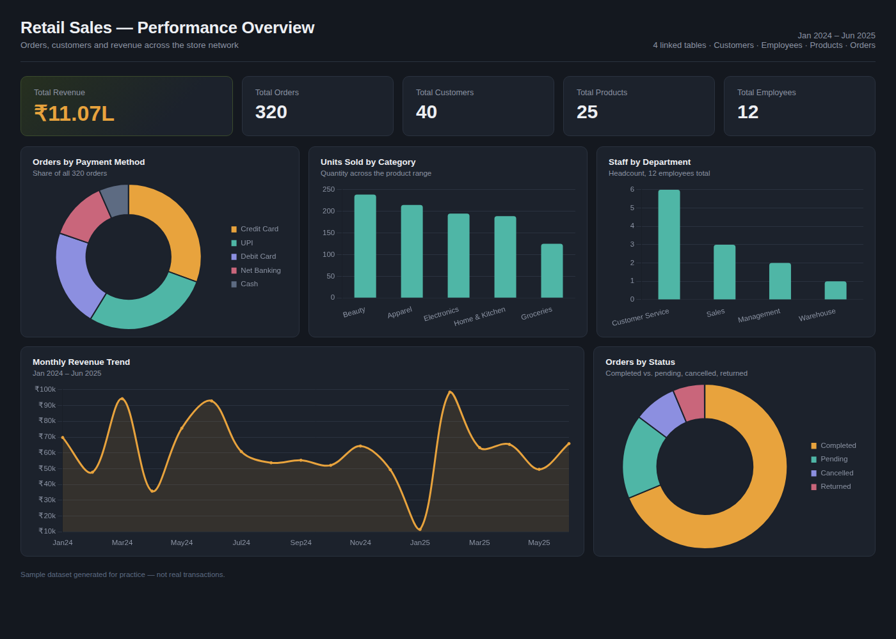

# Day 4 Assessment — Power BI Dashboard

**Name:** Jis Shajan
**Task:** Practice building a dashboard on a dataset of your choice.
**Dataset:** Retail Sales (Customers, Employees, Products, Orders)

## Dataset

A retail store dataset with four related tables:

| Table | Rows | Description |
|---|---|---|
| `Customers` | 40 | Customer name, gender, city, signup date |
| `Employees` | 12 | Employee name, department, hire date |
| `Products` | 25 | Product name, category, unit price |
| `Orders` | 320 | One row per order — date, customer, employee, product, quantity, status, payment method, revenue |

`Orders` is the fact table; the other three are dimension tables joined to it on their respective ID columns. Covers January 2024 – June 2025.

## Dashboard

**KPI cards:** Total Revenue, Total Orders, Total Customers, Total Products, Total Employees

**Charts:**
- Orders by Payment Method (donut)
- Units Sold by Category (column)
- Staff by Department (column)
- Monthly Revenue Trend (line)
- Orders by Status (donut)

## Key insights

- Total revenue across the period is **₹11,06,505** from **320 orders**.
- **UPI and Credit Card** together account for over half of all orders, ahead of Debit Card, Net Banking, and Cash.
- **Beauty and Apparel** are the top-selling categories by units, with Groceries the lowest.
- **Customer Service** handles the largest share of order volume among staff, followed by Sales.
- **68.75%** of orders are Completed; the rest are split across Pending, Cancelled, and Returned.
- Monthly revenue is uneven rather than steadily trending, with peaks in March 2024, June 2024, and February 2025.

## Tools used

- Power BI Desktop — data model, relationships, DAX measures, visuals
- Source data prepared in Excel (`Retail_Sales_Dataset.xlsx`)

## Files in this repo

- `README.md` — this write-up
- `dashboard_screenshot.png` — dashboard screenshot
- `Retail_Sales_Dataset.xlsx` — source data (Customers, Employees, Products, Orders)
